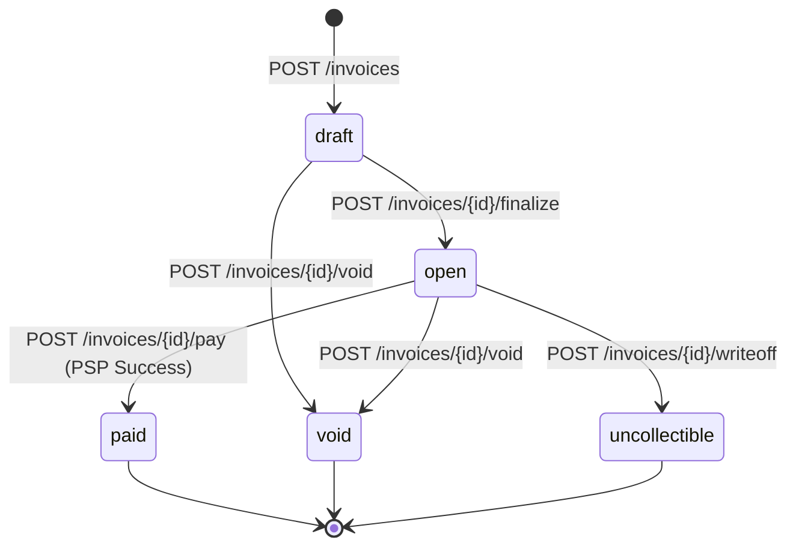

# DESIGN.md

# 1. Data Model

The service uses PostgreSQL as the system of record. All monetary values are stored as **INTEGER cents (USD only)**. No floating-point values exist in the payment path.

## Entity Relationship

```text
Business
├── Customers
├── API Keys
├── Webhook Endpoints
└── Invoices
    ├── Line Items
    └── Payment Attempts
```

## Tables

### businesses

| Column     | Type               |
| ---------- | ------------------ |
| id         | UUID PRIMARY KEY   |
| name       | TEXT NOT NULL      |
| created_at | TIMESTAMP NOT NULL |

**Purpose:** Tenant boundary for all resources.

**Indexes**

```sql
PRIMARY KEY (id)
```

**100x Scale**

* Natural shard key for tenant-based partitioning.

---

### api_keys

| Column      | Type                 |
| ----------- | -------------------- |
| id          | UUID PRIMARY KEY     |
| business_id | UUID NOT NULL        |
| key_hash    | TEXT NOT NULL        |
| key_prefix  | VARCHAR(12) NOT NULL |
| revoked_at  | TIMESTAMP NULL       |
| created_at  | TIMESTAMP NOT NULL   |

**Indexes**

```sql
(business_id)
(business_id, revoked_at)
```

**Design Choice**

* Only hashes are stored.
* Plaintext key shown once at creation.

**100x Scale**

* Frequently accessed hashes cached in Redis.

---

### customers

| Column      | Type               |
| ----------- | ------------------ |
| id          | UUID PRIMARY KEY   |
| business_id | UUID NOT NULL      |
| name        | TEXT NOT NULL      |
| email       | TEXT NOT NULL      |
| created_at  | TIMESTAMP NOT NULL |

**Indexes**

```sql
(business_id)
(business_id, email)
```

**Constraint**

```sql
UNIQUE (business_id, email)
```

---

### invoices

| Column      | Type               |
| ----------- | ------------------ |
| id          | UUID PRIMARY KEY   |
| business_id | UUID NOT NULL      |
| customer_id | UUID NOT NULL      |
| state       | TEXT NOT NULL      |
| total_cents | INTEGER NOT NULL   |
| due_date    | DATE NOT NULL      |
| created_at  | TIMESTAMP NOT NULL |
| updated_at  | TIMESTAMP NOT NULL |

**Valid States**

* draft
* open
* paid
* void
* uncollectible

**Indexes**

```sql
(business_id, state)
(customer_id)
```

**Constraints**

```sql
CHECK(total_cents >= 0)
```

---

### line_items

| Column            | Type             |
| ----------------- | ---------------- |
| id                | UUID PRIMARY KEY |
| invoice_id        | UUID NOT NULL    |
| description       | TEXT NOT NULL    |
| quantity          | INTEGER NOT NULL |
| unit_amount_cents | INTEGER NOT NULL |

**Constraints**

```sql
CHECK(quantity > 0)
CHECK(unit_amount_cents >= 0)
```

---

### payment_attempts

| Column        | Type               |
| ------------- | ------------------ |
| id            | UUID PRIMARY KEY   |
| invoice_id    | UUID NOT NULL      |
| status        | TEXT NOT NULL      |
| card_token    | TEXT NOT NULL      |
| psp_reference | TEXT NULL          |
| failure_code  | TEXT NULL          |
| created_at    | TIMESTAMP NOT NULL |
| updated_at    | TIMESTAMP NOT NULL |

**Statuses**

* processing
* succeeded
* failed
* unknown

**Indexes**

```sql
(invoice_id)
(psp_reference)
(status)
```

**Constraint**

```sql
UNIQUE(psp_reference)
```

**Purpose**

Payment processing state lives here, not inside Invoice.

This prevents invoices from becoming permanently stuck in a processing state.

---

### idempotency_keys

| Column        | Type               |
| ------------- | ------------------ |
| key           | TEXT PRIMARY KEY   |
| business_id   | UUID NOT NULL      |
| request_hash  | TEXT NOT NULL      |
| response_body | JSONB NOT NULL     |
| created_at    | TIMESTAMP NOT NULL |
| expires_at    | TIMESTAMP NOT NULL |

**Indexes**

```sql
(expires_at)
```

**Cleanup Job**

Deletes expired keys after 24 hours.

---

### webhook_outbox

| Column        | Type               |
| ------------- | ------------------ |
| id            | UUID PRIMARY KEY   |
| business_id   | UUID NOT NULL      |
| event_type    | TEXT NOT NULL      |
| payload       | JSONB NOT NULL     |
| attempt_count | INTEGER NOT NULL   |
| next_retry_at | TIMESTAMP NOT NULL |
| status        | TEXT NOT NULL      |
| created_at    | TIMESTAMP NOT NULL |

**Indexes**

```sql
(status, next_retry_at)
```

**Purpose**

Implements the Transactional Outbox Pattern.

---

### webhook_dead_letters

| Column    | Type               |
| --------- | ------------------ |
| id        | UUID PRIMARY KEY   |
| event_id  | UUID NOT NULL      |
| payload   | JSONB NOT NULL     |
| failed_at | TIMESTAMP NOT NULL |
| reason    | TEXT NOT NULL      |

**Purpose**

Stores permanently failed webhook deliveries.

---

# 2. Invoice State Machine



## Terminal States

* paid
* void
* uncollectible

## Trigger Mapping

| Transition           | Trigger                               |
| -------------------- | ------------------------------------- |
| draft → open         | POST /invoices/{id}/finalize          |
| draft → void         | POST /invoices/{id}/void              |
| open → paid          | POST /invoices/{id}/pay + PSP success |
| open → void          | POST /invoices/{id}/void              |
| open → uncollectible | POST /invoices/{id}/writeoff          |

## Reversible States

None.

## Invalid Transition Handling

Examples:

* paid → open
* paid → void
* void → paid

Response:

```json
{
  "error": "invalid_state_transition"
}
```

HTTP Status:

```text
409 Conflict
```

(Continue sections 3–7 exactly as in the PDF.)
